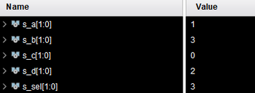
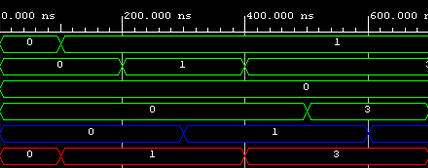

# Lab 3: Romain FRESNEAU

### Two-bit wide 4-to-1 multiplexer

1. Listing of VHDL architecture from source file `mux_2bit_4to1.vhd`. Always use syntax highlighting, meaningful comments, and follow VHDL guidelines:

```vhdl
architecture Behavioral of mux_2bit_4to1 is
begin

    with sel_i select
        f_o <= a_i when "00",  -- If sel_i = "00" then f_o = a_i
               b_i when "01",
               c_i when "10",
               d_i when others; -- All other combinations


end architecture Behavioral;
```

2. Listing of VHDL stimulus process from testbench file (`tb_mux_2bit_4to1`) 

```vhdl
    p_stimulus : process
begin
    -- Report a note at the begining of stimulus process
    report "Stimulus process started" severity note;
    s_c   <= "00"; s_d <= "00"; s_b <= "00"; s_a <= "00";
    s_sel <= "00"; wait for 100 ns;
    s_a   <= "01"; wait for 100 ns;
    s_b   <= "01"; wait for 100 ns;
    s_sel <= "01"; wait for 100 ns;
    s_b   <= "11"; wait for 100 ns;
    s_d   <= "11"; wait for 100 ns;
    s_sel <= "11"; wait for 100 ns;
    s_d   <= "10"; wait for 100 ns;
    -- Report a note at the end of stimulus process
    report "Stimulus process finished" severity note;
    wait;
end process p_stimulus;
```

3. Screenshot with simulated time waveforms. Always display all inputs and outputs (display the inputs at the top of the image, the outputs below them) at the appropriate time scale!

   
   
   
   
   
   ##My vivado tutorial :
   1. Create project
   2. Click next
   3. Select project type as RTL Project
   4. Add sources
   5. Create constraint files
   6. File -> Add Sources
   7. Select testbench, create file and must be named as tb_nameofproject
   8. Run simulation
   
