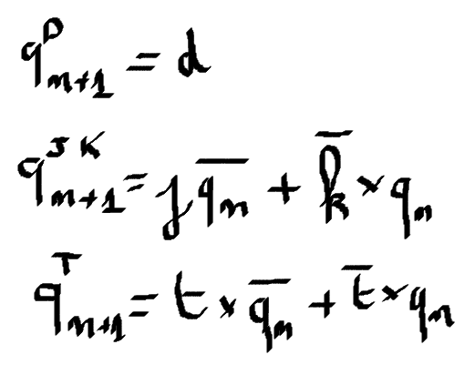

## Preparation tasks (done before the lab at home)
## Lab 2 :
*Digital* or *Binary comparator* compares the digital signals A, B presented at input terminal and produce outputs depending upon the condition of those inputs.

 Complete the truth table for 2-bit *Identity comparator* (B equals A), and two *Magnitude comparators* (B is greater than A, B is less than A). Note that, such a digital device has four inputs and three outputs/functions.

   | **Dec. equivalent** | **B[1:0]** | **A[1:0]** | **B is greater than A** | **B equals A** | **B is less than A** |
   | :-: | :-: | :-: | :-: | :-: | :-: |
   |  0 | 0 0 | 0 0 | 0 | 1 | 0 |
   |  1 | 0 0 | 0 1 | 0 | 0 | 1 |
   |  2 | 0 0 | 1 0 | 0 | 0 | 1 |
   |  3 | 0 0 | 1 1 | 0 | 0 | 1 |
   |  4 | 0 1 | 0 0 | 1 | 0 | 0 |
   |  5 | 0 1 | 0 1 | 0 | 1 | 0 |
   |  6 | 0 1 | 1 0 | 0 | 0 | 1 |
   |  7 | 0 1 | 1 1 | 0 | 0 | 0 |
   |  8 | 1 0 | 0 0 | 1 | 0 | 0 |
   |  9 | 1 0 | 0 1 | 1 | 0 | 0 |
   | 10 | 1 0 | 1 0 | 0 | 1 | 1 |
   | 11 | 1 0 | 1 1 | 0 | 0 | 0 |
   | 12 | 1 1 | 0 0 | 1 | 0 | 0 |
   | 13 | 1 1 | 0 1 | 1 | 0 | 0 |
   | 14 | 1 1 | 1 0 | 1 | 0 | 0 |
   | 15 | 1 1 | 1 1 | 0 | 1 | 0 |
## Lab 4 :

. A half adder has two inputs A and B and two outputs Carry and Sum. Complete the half adder truth table. Draw a logic diagram of both output functions.

    | **B** | **A** | **Carry** | **Sum** |
    | :-: | :-: | :-: | :-: |
    |  0  |  0  |  0  |  0  |
    |  0  |  1  |  0  |  1  |
    |  1  |  0  |  0  |  1  |
    |  1  |  1  |  1  |  0  |

2. A full adder has three inputs and two outputs. The two inputs are A, B, and Carry input. The outputs are Carry output and Sum. Complete the full adder truth table and draw a logic diagram of both output functions.

    | **Cin** | **B** | **A** | **Cout** | **Sum** |
    | :-: | :-: | :-: | :-: | :-: |
    |0|0|0|0|0|
    |0|0|1|0|1|
    |0|1|0|0|1|
    |0|1|1|1|0|
    |1|0|0|0|1|
    |1|0|1|1|0|
    |1|1|0|1|0|
    |1|1|1|1|1|

3. Find the relationship between half adder and full adder logic diagrams.

They are related so that the full adder is actually 2 halves and the OR gate at their output C.

### Decoder truth table for common anode 7-segment display

| Hex | Inputs | A | B | C | D | E | F | G |
| :-: | :-: | :-: | :-: | :-: | :-: | :-: | :-: | :-: |
| 0 | 0000 | 0 | 0 | 0 | 0 | 0 | 0 | 1 |
| 1 | 0001 | 1 | 0 | 0 | 1 | 1 | 1 | 1 |
| 2 | 0010 | 0 | 0 | 1 | 0 | 0 | 1 | 0 |
| 3 | 0011 | 0 | 0 | 0 | 0 | 1 | 1 | 0 |
| 4 | 0100 | 1 | 0 | 0 | 1 | 1 | 0 | 0 |
| 5 | 0101 | 0 | 1 | 0 | 0 | 1 | 0 | 0 |
| 6 | 0110 | 0 | 1 | 0 | 0 | 0 | 0 | 0 |
| 7 | 0111 | 0 | 0 | 1 | 1 | 1 | 1 | 1 |
| 8 | 1000 | 0 | 0 | 0 | 0 | 0 | 0 | 0 |
| 9 | 1001 | 0 | 0 | 0 | 0 | 1 | 0 | 0 |
| A | 1010 | 0 | 0 | 0 | 1 | 0 | 0 | 0 |
| b | 1011 | 1 | 1 | 0 | 0 | 0 | 0 | 0 |
| C | 1100 | 0 | 1 | 1 | 0 | 0 | 0 | 1 |
| d | 1101 | 1 | 0 | 0 | 0 | 0 | 1 | 0 |
| E | 1110 | 0 | 1 | 1 | 0 | 0 | 0 | 0 |
| F | 1111 | 0 | 1 | 1 | 1 | 0 | 0 | 0 |

## Lab 4 :

| **D** | **Qn** | **Q(n+1)** | **Comments** |
| :-: | :-: | :-: | :-- |
| 0 | 0 | 0 | no change |
| 0 | 1 | 0 | change |
| 1 | 1 | 1 | no change |
| 1 | 0 | 1 | change |

| **J** | **K** | **Qn** | **Q(n+1)** | **Comments** |
| :-: | :-: | :-: | :-: | :-- |
| 0 | 0 | 0 | 0 | no change |
| 0 | 0 | 1 | 1 | no change |
| 0 | 1 | 0 | 0 | reset |
| 0 | 1 | 1 | 0 | reset |
| 1 | 0 | 0 | 1 | set |
| 1 | 0 | 1 | 1 | set |
| 1 | 1 | 0 | 1 | toggle |
| 1 | 1 | 1 | 0 | toggle |

| **T** | **Qn** | **Q(n+1)** | **Comments** |
| :-: | :-: | :-: | :-- |
| 0 | 0 | 0 | no change |
| 0 | 1 | 1 | no change |
| 1 | 0 | 1 | toggle invert |
| 1 | 1 | 0 | toggle invert |

## Lab 5 :

| **Time interval** | **Number of clk periods** | **Number of clk periods in hex** | **Number of clk periods in binary** |
| :-: | :-: | :-: | :-: |
| 2ms | 200 000 | `x"3_0d40"` | `b"0011_0000_1101_0100_0000"` |
| 4ms | 400 000 | `x"6_1A80"` | `b"0110_0001_1010_1000_0000"` |
| 10ms | 1 000 000 | `x"F_4240"` | `b"1111_0100_0010_0100_0000"` |
| 250ms | 25 000 000 | `x"17D_7840"` | `b"0001_0111_1101_0111_1000_0100_0000"` |
| 500ms | 50 000 000 | `x"2FA_F080"` | `b"0010_1111_1010_1111_0000_1000_0000"` |
| 1sec | 100 000 000 | `x"5F5_E100"` | `b"0101_1111_0101_1110_0001_0000_0000"` |

